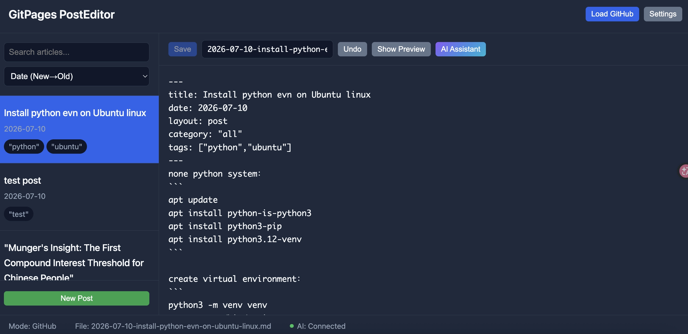

# GitPages Posts Editor

A pure frontend single-page application for managing GitHub Pages blog posts (Jekyll `_posts`) via the GitHub API.

No backend server required — all code runs in the browser, and configuration is stored in `localStorage`.



[README 中文版本](./README-zh.md)

## Features

- **GitHub API Integration**
  - Load `_posts` directory from remote repository, parse Jekyll frontmatter
  - Create, edit, rename, and delete articles
  - Token permission detection (supports Classic PAT and Fine-grained PAT)
- **Markdown Editor**
  - Split-pane editing with live preview (marked.js + highlight.js)
  - Automatic frontmatter separation/merging — full formatting preserved on save
  - Content change detection and one-click undo
- **Editable Filename**
  - Modify filename directly in the toolbar; auto-renames in Git repo on save (PUT new → DELETE old)
- **AI Assistant (LMStudio)**
  - Content generation, optimization, and translation
  - AI result only replaces body content, preserving original frontmatter
  - Loading animation with connection status indicator
- **Article Management**
  - Search and sort (by date / title)
  - Hover-to-reveal delete button on list items (× → confirm → GitHub API DELETE)
- **Dark theme UI** with responsive layout

## Quick Start

### Prerequisites

A GitHub repository with a `_posts` folder in the root directory containing Jekyll-formatted `.md` articles.

### 1. Get a GitHub Token

- Visit https://github.com/settings/tokens
- Click **Fine-grained personal access tokens**
- Click **Generate new token**
- Click **Add permissions** → **Contents** → **Access: Read and write**
- Copy the generated token (format: `ghp_xxxxxxxxxxxx`)

### 2. Launch the App

```bash
# Open directly in browser (local file mode, view only)
open index.html

# Recommended: serve with a local server (fewer security restrictions)
python3 -m http.server 8000
# Visit http://localhost:8000
```

### 3. Configure & Load

1. Click **Settings**
2. Fill in:
   - Repository owner (username)
   - Repository name
   - GitHub Token
   - Branch (default `main`)
3. Click **Test Connection** to verify token permissions
4. Save settings — the app will automatically load the `_posts` directory

### Configure LMStudio

1. Download and install [LMStudio](https://lmstudio.ai/)
2. Load a model (e.g., Llama 3, Qwen, etc.)
3. Start the local server (default `http://localhost:1234`)
4. Enter the API URL and model name in the app settings

## Keyboard Shortcuts

| Shortcut | Function |
|----------|----------|
| `Cmd/Ctrl + S` | Save article |
| `Cmd/Ctrl + Enter` | Generate AI content (when AI panel is open) |

## Project Structure

```
├── index.html              # Main page
├── css/
│   └── style.css           # Styles (dark theme)
├── js/
│   ├── app.js              # App main logic, event bindings
│   ├── fileManager.js      # GitHub API file management (CRUD)
│   ├── editor.js           # Editor, preview, undo, filename editing
│   ├── aiAssistant.js      # LMStudio AI assistant
│   └── utils.js            # Utility functions (frontmatter parse/generate, Toast)
├── docs/                   # Design documents (if any)
└── README.md
```

## Tech Stack

| Technology | Purpose |
|------------|---------|
| HTML5 / CSS3 / ES6+ | Frontend foundation |
| [marked.js](https://marked.js.org/) | Markdown → HTML rendering |
| [highlight.js](https://highlightjs.org/) | Code block syntax highlighting |
| GitHub REST API v3 | Repository content read/write |
| LMStudio API (OpenAI-compatible) | Local LLM inference |

## Browser Compatibility

- ✅ Chrome 86+
- ✅ Edge 86+
- ✅ Firefox 90+
- ⚠️ Safari (not fully tested)

## License

MIT
